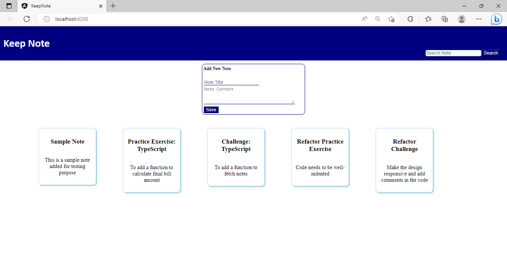

## Challenge - Implement Persistence in the `Keep-Note` Application

### Points to Remember
- The code to make server requests should not be written inside the Angular components.​
    - Separate services should be created to make the fetch and post requests. ​
- The URL for making server requests should be stored in a variable and should not be hardcoded while making server requests. ​
- The `OnInit` interface and its `ngOnInit()` lifecycle method should be implemented for fetching data from the server. ​
​
### Instructions for Challenge

- Fork the boilerplate into your own workspace. ​
- Clone the boilerplate into your local system. ​
- Open command terminal and set the path to the folder containing the cloned boilerplate code.​
- Run the command `npm install` to install the dependencies.
- Open the folder containing the boilerplate code in VS Code.​
- Complete the solution in the given partial code provided in the boilerplate.

Notes:
1. The solution of this challenge will undergo an automated evaluation on the `CodeReview` platform. (Local testing is recommended prior to the testing on the `CodeReview` platform)
2. The test cases are available in the boilerplate.

### Context

As you are aware, `Keep-Note` is a web application that allows users to maintain notes. It is developed as a single-page application using multiple components. 

Note: The stages through which the development process will be carried out are shown below:
- Stage 1: Create basic `Keep-Note` application to add and view notes.
- Stage 2: Implement unit testing for the `Keep-Note` application.
- Stage 3: Create `Keep-Note` application with multiple interacting components to add, view and search notes.
- **Stage 4: Implement persistence in the `Keep-Note` application.**
- Stage 5: Style the `Keep-Note` application using Material design.
- Stage 6: Create simple form with validation in the `Keep-Note` application.
- Stage 7: Create complex form with validation in the `Keep-Note` application.
- Stage 8: Enable navigation in the `Keep-Note` application.
- Stage 9: Secure routes in the `Keep-Note` application

In this sprint, we are at Stage 4.

In this stage, persistence needs to be implemented in the `Keep-Note` application.

The notes should be fetched from and saved in the `notes.json` file located in the `keep-note-data` folder. This will be done by making HTTP requests to the `json-server`.

#### Problem Statement

Implement persistence in the `​Keep-Note` application to make HTTP requests to fetch ​and post notes data​ using Angular Services.

The components of the application should consume this service to add, fetch and search notes.

If any error is returned with the response, then the components should handle it and raise an alert with appropriate error message.

​Note: Tasks to complete the challenge are given below: 

#### Task 1: Create Note Service
- Create `NoteService` using Angular CLI command inside the `services` folder.
- Inject `HttpClient` dependency in the service class.
- Define `getNotes()` method to make HTTP request to the defined URL to fetch notes.
- Define `addNote()` method to make HTTP request to the defined URL to post note data to server.

Note: The service name and method names mentioned above are used in testing, so you must use the same names while coding. 

#### Task 2: Add a New Note
- Modify the `addNote()` method of the `NoteAddComponent` class.
- The method should call the `addNote()` method of the `NoteService` to add note to server.
- The application should raise an alert with the message `Note Added` if the note gets successfully added.
- The application should raise an alert with the error message `Failed to Add Note Due to Server Error !!` if the server responds with error.

Note: The alert messages mentioned above are used in testing, so you must use the same message text while coding. 

#### Task 3: Fetch and Display Notes
- The `NoteViewComponent` should call the `getNotes()` method of the `NoteService` to fetch all the notes from server when the component gets initialized.
- The code should also handle error by raising an alert with the message `Failed to Fetch Notes Due to Server Error !!`, if the request returns with an error response.
- The component should refresh the notes on view whenever a new note gets added.

Note: The alert messages mentioned above are used in testing, so you must use the same message text while coding. 

#### Task 4 - Search Note
- Modify the `onSearchTextChanged()` method which gets invoked when the `searchTextChanged` event is emitted by the `SearchComponent`.
- The method should call the `getNotes()` method of `NoteService` and update the `notes` property with the filtered data if the `searchText` is not empty. 
    - If the search text is empty the method should update the `notes` property with all the notes data fetched from the server.

##### Expected Output

- Style the components by defining CSS classes in their respective `.css` file for better look and feel.
- The sample layout suggested for the `Keep Note` app is provided in the image below:

### Test the Solution Locally​

Test the solution first locally and then on the `CodeReview` platform. Steps to test the code locally are:
- From the command line terminal, set the path to the folder containing cloned boilerplate code.
- Run the command `ng test` or `npm run test` to test the solution locally and ensure all the test cases pass.
- Refactor the solution code if the test cases are failing and do a re-run.​
- Finally, push the solution to git for automated testing on the CodeReview platform.

### Test the Solution on the `CodeReview` Platform

Steps to test the code on the `CodeReview` platform are:
- Open the submission page at [https://codereview.stackroute.niit.com/#/submission](https://codereview.stackroute.niit.com/#/submission).
- Submit the solution.
- For the failed test cases, refactor the code locally and submit it for re-evaluation.
